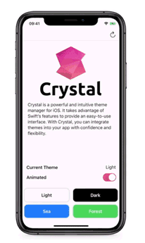

<p align="center">

</p>

---

Crystal is a lightweight and intuitive theme manager for iOS. It takes advantage of Swift’s features to provide an easy-to-use interface. With Crystal, you can integrate themes into your app with confidence and flexibility.

<p align="center">

</p>

## Feature

- **Flexible**: Crystal is compitible with any object, not just built-in UI components. You can use Crystal anywhere.
- **Friendly**: Apply themes in a way you're familiar with, and no additional property APIs will make you confused and distracted.
- **Simple**: Adding a theme is as simple as creating an instance. It's easy to maintain your themes with Crystal.
- **Type Safe**: Take full advantage of swift's type safety. Apply your theme with confidence and benefit from compile-time check.


## Usage

### Define Theme Type

You can introduce your theme type by making `class` or `struct` conform to `CrystalThemeType` protocol. With this protocol, you have to implement a static property to return the default theme.

```swift
struct AppTheme {
    var textColor: UIColor
    var backgroundColor: UIColor
}

extension AppTheme: CrystalThemeType {
    // Return the default theme.
    public static var `default`: CrystalThemeType {
        return Self.light
    }

    static var light: AppTheme {
        return AppTheme(
            textColor: .black,
            backgroundColor: .white
        )
    }

    static var dark: AppTheme {
        return AppTheme(
            textColor: .white,
            backgroundColor: .black
        )
    }
}
```

### Make Compatible

In order to tell Crystal about your theme type:
- Make `Crystal` conform to `CrystalDetermined`. 
- Make any type conform to `CrystalDetermined` according to your needs.

Use `typealias` to determine the concrete theme type.

```swift
// Required. Determine the concrete theme type.
extension Crystal: CrystalDetermined {
    public typealias Theme = AppTheme
}

// Optional. Make any type compatible as you need.
extension UIView: CrystalCompatible {
    public typealias Theme = AppTheme
}
extension UIBarButtonItem: CrystalCompatible {
    public typealias Theme = AppTheme
}
```

Any object that conforms to `CrystalCompatible` protocol has a `cst` namespace for exposing Crystal methods.


### Apply Theme

Use the `apply(key:_:)` method to apply theme. The `key` parameter can be omitted and the default  `key` value will be used.

```swift
// Apply theme to a button.
doneButton.cst.apply { button, theme in
    button.setTitleColor(theme.textColor, for: .normal)
}
// Apply theme to a custom view.
cardView.cst.apply { card, theme in 
    card.backgroundColor = theme.backgroundColor
    card.titleColor = theme.textColor
}
// Shorthand argument names.
imageView.cst.apply { $0.tintColor = $1.textColor }
```

When you call this method on an object multiple times, the `key` parameter is used to distinguish different calls. If the same `key` value is used, only the last call takes effect. This behavior is intended to avoid unintentional and redundant calls.

```swift
// Set font.
textLabel.cst.apply(key: "font") { label, theme in
    label.font = theme.font
}
// Set text color. Will be discarded.
textLabel.cst.apply(key: "text color") { label, theme in
    label.textColor = .black
}
// Overwrite the previous call.
textLabel.cst.apply(key: "text color") { label, theme in
    label.textColor = theme.textColor
}
```

### Change Theme

Use the `setTheme(_:animated:)` method to change theme.

```swift
// Change theme with animation.
Crystal.shared.setTheme(.dark, animated: true)
```